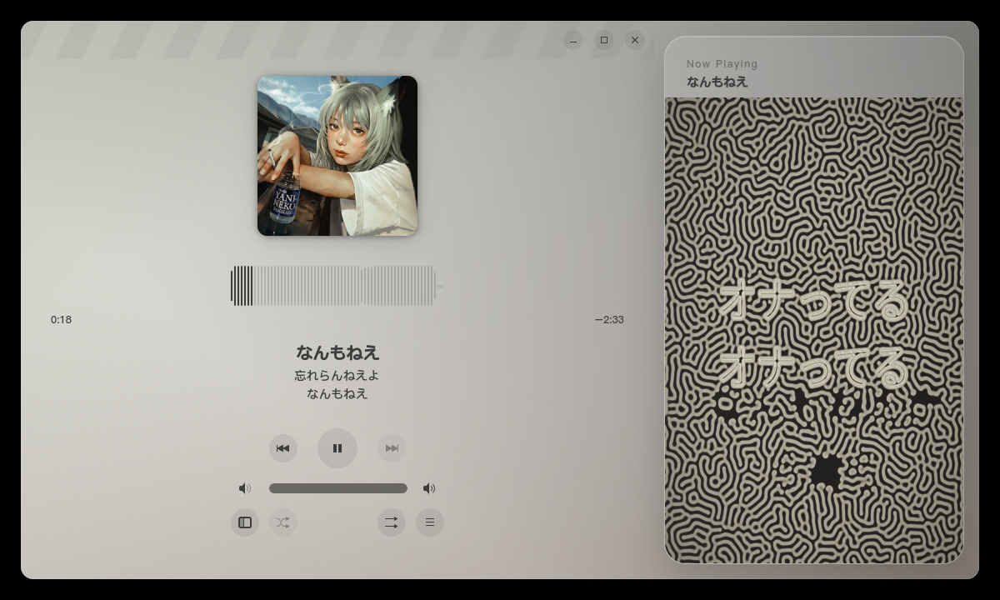

# Amberol Glass Lyrics

基于 **Amberol** 播放器本体制作的 Linux 桌面音乐播放器实验分支：添加了一个基于图灵扩散视觉效果的动态歌词卡片。

> **平台状态：目前只适配 Linux。Windows 与 macOS 版本会在后续有空时继续处理。**
>
> **Platform status: Linux only for now. Windows and macOS ports are planned for a later stage.**



## 项目来源与致谢

- **播放器本体：Amberol**，由 Emmanuele Bassi 与 GNOME 社区开发。本项目保留 Amberol 的本地播放、播放队列、封面取色、波形、MPRIS 与 GStreamer 后端。上游项目：[GNOME / Amberol](https://gitlab.gnome.org/World/amberol)。
- **图灵纹斑与歌词视觉方向：参考抖音博主「李铣豆」的相关创作。**
- Gray-Scott 参数与 GPU 实现参考了博主的仓库 [ph-200711/Turing-Patterns-Music-Video-Generator](https://github.com/ph-200711/Turing-Patterns-Music-Video-Generator) 的音乐视频生成方案。

Amberol 原项目与本项目均按照 GPL-3.0-or-later 发布。有关上游版权信息请参阅仓库中的 `LICENSES/`、`REUSE.toml` 与源码文件头。

## 当前功能

- 原生 Rust + GTK4 + libadwaita 桌面应用；
- GStreamer 本地音乐播放、队列、随机/循环与 MPRIS；
- 文件夹导入会递归检索所有子文件夹，也支持指向音乐目录的符号链接；
- 同名 `.lrc` 自动加载，支持多时间标签和 `[offset]`；
- 毫秒级歌词时间轴；
- 音频内容决定随机种子，Gray-Scott 小圆点真实生长为连续图灵纹斑；
- 初始化完成后才从歌曲开头播放；
- 歌词在纹斑中生成空腔，唱完后由同一化学场自然回填；
- 歌词边缘带一圈很细的白色化学描边；
- 图灵纹斑颜色由专辑封面的多种提取色混合生成；
- 歌词卡片固定在播放界面右侧上层，不再通过按钮弹出或扩展顶层窗口；
- 默认采用约 2:1 的播放器/歌词比例；播放器会持续横向压缩并为卡片让位，仅在极窄窗口中转为上层覆盖；
- 卡片外区域保持完全透明，不给播放器叠加白色、模糊或半透明底色；
- 播放队列可独立打开，不改变歌词卡片的固定状态。

## 安装 Debian 软件包

从 GitHub Releases 下载最新的 `amberol-glass-lyrics_*_amd64.deb`，然后运行：

```bash
sudo apt install ./amberol-glass-lyrics_*_amd64.deb
```

安装完成后可在 GNOME 应用菜单中搜索 **Amberol Glass Lyrics**，或运行：

```bash
amberol-glass-lyrics
```

当前 `.deb` 面向 x86_64 Linux，并依赖较新的 GTK4、libadwaita 与 GStreamer 运行环境。

## 歌词文件

把 LRC 放在音频文件旁边并使用相同文件名：

```text
song.flac
song.lrc
```

示例：

```lrc
[offset:-120]
[00:05.230]第一句歌词
[00:09.840]第二句歌词
```

应用也会读取 FLAC 元数据中的同步歌词；同名 `.txt` 可作为普通文本后备。

## 操作

- 歌词卡片始终固定在播放界面右侧；
- 缩放窗口：宽屏时播放器与歌词约为 2:1，缩窄时播放器优先压缩避让，极窄时使用和播放列表相同的自适应覆盖；
- 拖入音频文件或目录：递归检索目录及其子目录后加入播放队列。

## 从源码构建

### 依赖

- Rust / Cargo
- Meson + Ninja
- GTK 4
- libadwaita 1
- GStreamer 1.0（base、audio、play、bad audio）
- Blueprint Compiler

### 开发构建

```bash
meson setup builddir -Dprofile=development
meson compile -C builddir
meson devenv -C builddir src/amberol-glass-lyrics /path/to/song.flac
```

### Release 构建

```bash
meson setup build-release -Dprofile=default --buildtype=release
meson compile -C build-release
```

### 构建 `.deb`

```bash
./packaging/build-deb.sh
```

软件包输出到 `dist/`。

## 图灵歌词实现

状态纹理为双通道 Gray-Scott U/V 化学场，使用 Ping-Pong FBO 持续更新。歌词由 Pango/Cairo 生成化学边界输入，显示 Shader 只根据化学浓度、梯度和专辑封面混合色绘制画面。详细设计见：

- [`docs/图灵歌词原型.md`](docs/图灵歌词原型.md)
- [`docs/反应扩散参考实现.md`](docs/反应扩散参考实现.md)
- [`docs/桌面应用使用说明.md`](docs/桌面应用使用说明.md)

## 测试

```bash
cargo test --all
meson test -C builddir --print-errorlogs
```

## License

GPL-3.0-or-later。播放器上游 Amberol 的版权归其原作者与贡献者所有；本项目新增的歌词面板、反应扩散画布与桌面整合代码沿用相同许可。
